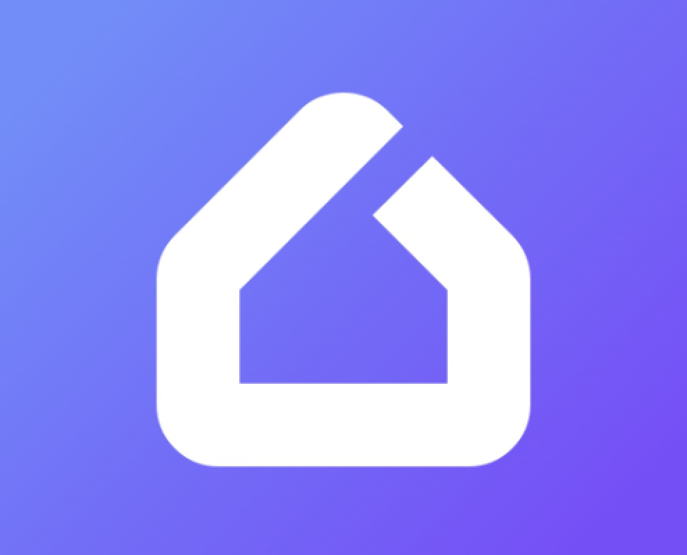

# My Home

iOS client for the MySmartHome hub. Control your devices, scenarios, and rooms from your iPhone.



## Before you start

- iPhone running **iOS 18.6** or newer
- A free **Apple ID**
- A computer (Mac or PC) — needed **once**, to pair your phone. Everything after that happens on the phone.

## Install SideStore

The app is distributed through [SideStore](https://sidestore.io) — a free, on-device signer that installs apps using your own Apple ID. Nothing you install this way leaves your phone.

1. Follow the official [SideStore setup guide](https://sidestore.io/#get-started) to install SideStore and pair your phone. This is the one step that needs a computer.
2. Open SideStore → **Settings → Account** and sign in with your Apple ID. Use an [app-specific password](https://support.apple.com/en-us/HT204397), not your real one.
3. Open **Settings → Anisette Servers** and paste a server list, then pick any server that shows as online. Anisette lets SideStore sign apps with your Apple ID — the built-in default is often down, so a custom list is the reliable fallback. You can use either:

   - The maintainer's curated list (self-hosted server first, then community fallbacks):

     ```
     https://gist.githubusercontent.com/IlyaMatsuev/c3d5181a9260493d8a861bd80506ace4/raw/sidestore-anisette-servers.json
     ```

   - Or the public community list:

     ```
     https://servers.sidestore.io/servers.json
     ```

## Add the My Home source

In SideStore, tap **Sources → +** and paste this URL:

```
https://ilyamatsuev.github.io/SmartHomeAppIOS/apps.json
```

## Install the app

1. Open the **My Home** source you just added.
2. Tap the app → **Free Download**.
3. Wait for SideStore to sign and install. The app appears on your Home Screen.

## Keep the app refreshed

Apps signed with a free Apple ID expire every **7 days**. SideStore renews them automatically in the background — no computer needed:

1. iOS **Settings → General → Background App Refresh** — turn it on globally and for SideStore.
2. SideStore → **Settings → Background Refresh** — enable it, set a daily interval.
3. Keep SideStore's WireGuard VPN profile enabled — on-device signing needs it.

> If a refresh fails, open SideStore → **My Apps** and pull down to refresh manually.

## Updates

New versions show up automatically in **My Apps** — pull to refresh and tap **Update**.

---

Source code: [github.com/IlyaMatsuev/SmartHomeAppIOS](https://github.com/IlyaMatsuev/SmartHomeAppIOS) · Licensed under [PolyForm Noncommercial](https://github.com/IlyaMatsuev/SmartHomeAppIOS/blob/main/LICENSE).
